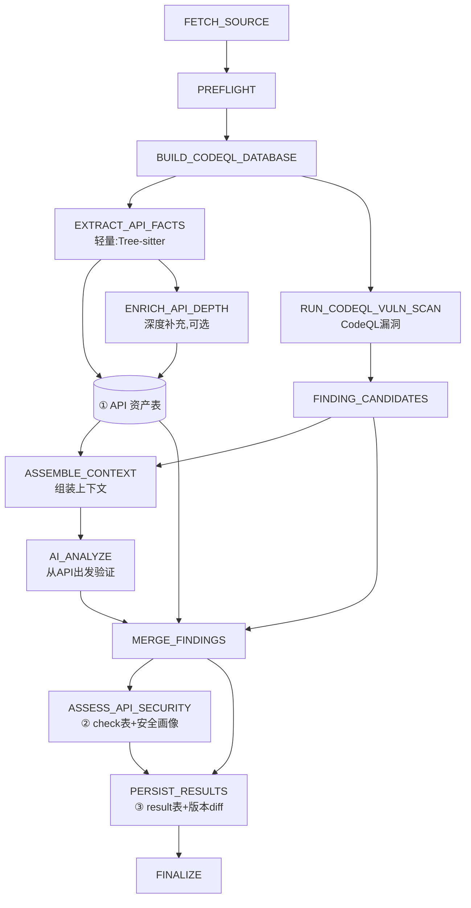
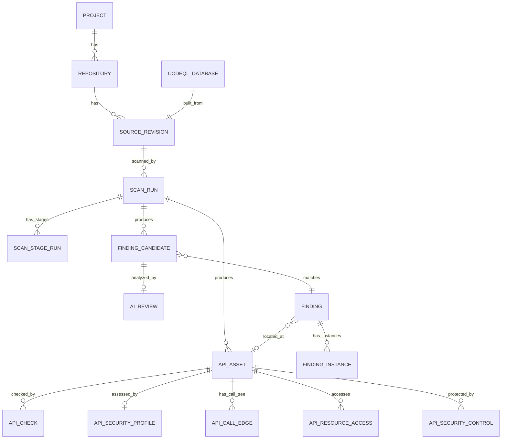

# 01. 核心数据流

> [← 00-overview](00-overview.md)　|　下一章：[02-build](02-build.md)

**全文枢纽。** 一个 commit 怎么变成三张表，都在这张图里。

## 阶段执行 DAG



### 关键设计点

1. **EXTRACT_API_FACTS 依赖编译成功**——代码不完整时提取不可信
2. **API 资产分两层**——轻量先出（立即可用）+ 深度后补（可选）
3. **CodeQL 只扫漏洞**——不提取 API 信息
4. **ENRICH_API_DEPTH 可选**——失败不影响资产表初版
5. **AI 从 API 入口出发**——不从告警行出发
6. **NEED_MORE_CONTEXT 闭环**——AI 声明缺什么，编排器补取后再问

## 阶段定义表

| 阶段 | required | on_failure | 输入 | 输出 |
|---|---|---|---|---|
| FETCH_SOURCE | ✓ | ABORT | repo_id + revision_ref | SOURCE_ARCHIVE |
| PREFLIGHT | ✓ | ABORT | source_artifact_id | BUILDFPLAN_JSON |
| BUILD_CODEQL_DATABASE | ✓ | DEGRADE | commit_sha + build_plan_hash | CODEQL_DATABASE |
| EXTRACT_API_FACTS | ✓* | ABORT | source_artifact_id | ① API 资产表初版 |
| ENRICH_API_DEPTH | ✗ | CONTINUE | api_asset_ids | 调用链/资源/数据流 |
| RUN_CODEQL_VULN_SCAN | ✓ | ABORT | codeql_db_id + rule_pack | CODEQL_SARIF |
| FINDING_CANDIDATES | ✓ | ABORT | sarif_id | 漏洞候选 |
| ASSEMBLE_CONTEXT | ✗ | CONTINUE | candidate_ids + api_asset_ids | EVIDENCE_BUNDLES |
| AI_ANALYZE | ✗ | CONTINUE | evidence_bundle_ids | AI_REVIEWS |
| MERGE_FINDINGS | ✓ | ABORT | candidates + ai_reviews + api_assets | MERGED_FINDINGS |
| ASSESS_API_SECURITY | ✗ | CONTINUE | api_assets + findings | ② check表 + 安全画像 |
| PERSIST_RESULTS | ✓ | ABORT | merged + security | ③ result表 + 版本diff |
| FINALIZE | ✓ | ABORT | scan_run_id | 报告 |

\* BUILD 降级 NO_BUILD 时 EXTRACT_API_FACTS 标 SKIPPED。

## 三张表的关系

```
① API 资产表（api_asset）
   每行一个 API，列：入口/参数/调用链/资源/鉴权/校验...
   ↓
② check 表（api_check + api_security_profile）
   每个 API × 每个检查项 = 分级结果
   汇总成四维度安全画像
   ↓ 动态切割上下文
③ result 表（ai_review + finding_instance）
   AI 验证后的最终判定 + 证据 + 修复建议

漏洞清单（finding_candidate → finding → finding_instance）
   只记实际发现的问题，是 check 表中 result≠PASS 项的子集
```

## 核心对象关系


